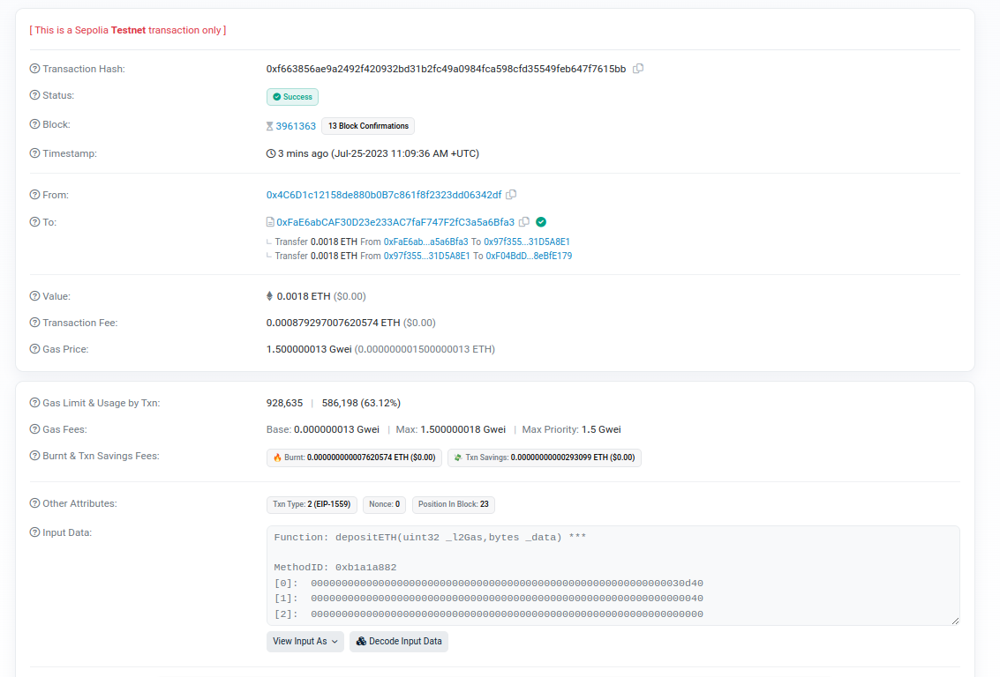

# Class 1 - Introduction

## Etherscan 
* Etherscan is a block explorer and analytics platform for Ethereum
* To view transactions, we can go to https://etherscan.io/txs:


### Why are there so many zero value transactions?
* These txns are including a small piece of data in each transaction, writing information onto the blockchain. e.g ERC20 transfers, calling smart contract methods, storing or sending data, etc.
* However, they still do pay the gas fees required for that transaction. 

### Example of a Smart Contract Transaction 
* The `Input Data` section stores the code (as bytes) which is executed in the EVM 
        
* The recipient address (To) here is a contract
        
## Wallet  
[from the Ethereumbook]
* A software application that helps you manage your Ethereum account. e.g MetaMask, Jaxx, MyEtherWallet, Emerald Wallet
* Each user of Ethereum can and should control their own private keys, which are used to access funds and smart contracts. The combination of funds + smart contracts is referred to as a wallet/account. One private key equals one "account".
  
## Testnet Faucets
* An Ethereum faucet is a developer tool to get testnet Ether (ETH) in order to test and troubleshoot your decentralized application or protocol before going live on Ethereum mainnet, where one must use real Ether. eg - Seploia, Goerli  
* To get test ETH on Sepolia :

  1. Go to https://sepoliafaucet.com/

  2. Signin with Alchemy

  3. Enter Metamask wallet address, click on Send Me ETH  

Details of the transcaction I made:   
https://sepolia.etherscan.io/tx/0x339a312d6e1af90d959e0439524eed77b0c094a812ecb45d3cb3fbcd2ad96609  


The state change can be observed here:  


## Uniswap
Uniswap is the largest decentralized exchange (or DEX) operating on the Ethereum blockchain. It allows users anywhere in the world to trade crypto without an intermediary.  
Swapping a token on Uniswap :  
1. Visit https://app.uniswap.org/#/swap

2. Connect your Metamask wallet 
3. Select the tokens to convert from and to, and enter the amount

    
4. Confirm on Metamask

    
5. Now we have 1.08 UNI in our Uniswap account, which can be further swapped into other tokens

## Remix
Remix is an online IDE which lets us run 
write and compile Solidity code.  
https://remix.ethereum.org/  
Docs : https://remix-ide.readthedocs.io/en/latest/
   * Smart Contract structure: https://docs.soliditylang.org/en/latest/structure-of-a-contract.html
   * Layout of Solidity Source Files : https://docs.soliditylang.org/en/latest/layout-of-source-files.html
   * Grammar : https://docs.soliditylang.org/en/latest/grammar.html

Writing and deploying a contract : 
1. Create a new blank workspace
2. Add a .sol file to define the smart contract - eg. HelloWorld.sol
3. // SPDX-License-Identifier: MIT : license
4. pragma solidity ^0.5.2; - used to specify which versions of the compiler an run this
5. Contract names can't be reserved keywords like pragma, etc
6. The Smart contract as of now:
    ```
    // SPDX-License-Identifier: MIT
    pragma solidity >=0.7.0 <0.9.0;

    contract HelloWorld{
        constructor(){}
       function helloWorld() public pure returns (string memory) {
           return "Hello World";
       }
    }
    ```
7. Compile the contract :  

    
8.  Deploy the contract: 
    
    
9.  After deploying, we can call the function:
    


