# Class 2 - Solidity Basics

## Contracts 
Contracts are similar to classes in object-oriented languages. They contain persistent data in state variables, and functions that can modify these variables.

* Contracts can be created in Solidity in IDEs like Remix or in JS using web3.js

## Constructor
* Constructor (optional) : When a contract is created, its constructor (a function declared with the constructor keyword) is executed once.
    ```
    contract HelloWorld {
        string private text; 
        constructor() {
            text = "Hello World";
        }
    }

    ```
* After the constructor has executed, the final code of the contract is stored on the blockchain. This code:
  * Includes - All public and external functions and all functions that are reachable from there through function calls.
  * Does not include - Constructor code or internal functions only called from the constructor


## State Variables

State variables are variables whose values are permanently stored in contract storage.
```
contract SimpleStorage {
    uint storedData; // State variable
}
```
### State Visibility  

| Visibility Type   |private|  internal |  public |
|----------|:-------------:|------:|------:|
| Can be accessed from |  same contract | same contract, derived contracts |  same contract, derived contracts, external contracts |

Default visibility if not explicitly defined : internal
## Functions 

Can be defined both inside and outside of contracts

```solidity
// SPDX-License-Identifier: GPL-3.0
pragma solidity >=0.7.1 <0.9.0;

contract SimpleAuction {
    function bid() public payable { // Function
        // ...
    }
}

// Helper function defined outside of a contract
function helper(uint x) pure returns (uint) {
    return x * 2;
}
```
### Function Visibility

| Visibility Type   |private|  internal |  public | external |
|----------|:-------------:|------:|------:|------:|
| Can be accessed from |  same contract | same contract, derived contracts |can be either called internally or via message calls | can be called from other contracts and via transactions, not internally |
| Part of ABI(Application Binary Interface)|no|no|yes|yes|


**Note on visibiltiy** :  Making something private or internal only prevents other contracts from reading or modifying the information, but it will still be visible to the whole world outside of the blockchain.
### Getter Functions and public variables
* The compiler automatically creates getter functions (a function with the same name as the state variable) for all public state variables. e.g: 

    ```
    // SPDX-License-Identifier: GPL-3.0
    pragma solidity >=0.4.16 <0.9.0;
    
    contract C {
        uint public data = 42;
    }
    
    contract Caller {
        C c = new C();
        function f() public view returns (uint) {
            return c.data();
        }
    }
    ```
* The getter functions have external visibility. If the symbol is accessed internally (i.e. without this.), it evaluates to a state variable. If it is accessed externally (i.e. with this.), it evaluates to the getter function.

    ```
    // SPDX-License-Identifier: GPL-3.0
    pragma solidity >=0.4.0 <0.9.0;
    
    contract C {
        uint public data;
        function x() public returns (uint) {
            data = 3; // internal access
            return this.data(); // external access
        }
    }
    ```
* Setter functions are not generated so other contracts cannot directly modify their values

## Demonstrating visibility through Code
* Example 1 : Private state variable and private function, these can't be called from the Deployed Contracts section  

    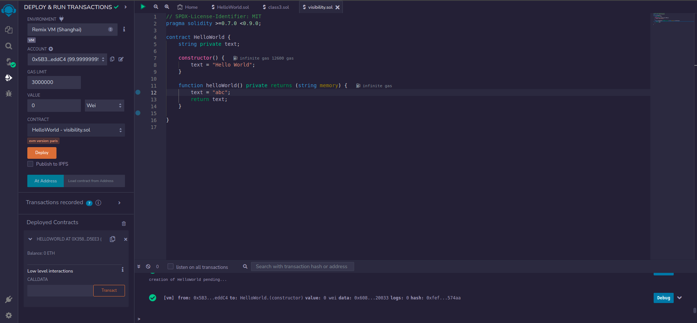
* Example 2 : Private and public state variables, public function. The public variables and function can be called :

    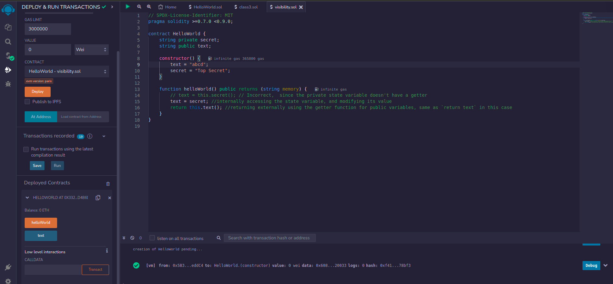
* Dry run for Example 2:  
    1. First we call `text`, without calling  `helloWorld`, and get `"abcd"` as the output, because after deploying the contract, the constructor runs initially  
        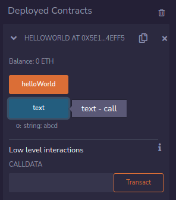
    2. Then, we call `helloWorld` once and then call  `text` again, and get `"Top Secret"` this time  
        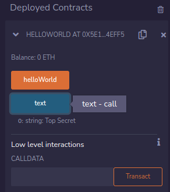
* Example 4 : Demonstrating calling of a function, when its private, internal, public, external. We have a base SmartContract with two functions helloWorld() and helloWorld2(), an inherited contract and an external contract. I'm trying to understand how the visibility changes, from the perspective of calling helloWorld().
   
    1. Private : helloWorld is private:
        ```
            // SPDX-License-Identifier: MIT
            pragma solidity >=0.7.0 <0.9.0;
        
            contract SmartContract {
                string public text;
        
                constructor() {
                    text = "abcd";
                }
        
                function helloWorld() private  view returns (string memory) {
                    return text;
                }
        
                function helloWorld2() public  returns (string memory) {
                    text = helloWorld(); //Okay - Private function can be accessed from same Contract
                    return text;
                }
            }
        
            // Inherited contract
            contract InheritedContract is SmartContract {
                function helloWorld3() public view returns (string memory) {
                    // return helloWorld();  // Error - Private function can't be accessed from derived Contract
                }
            }
        
            //External contract using the SmartContract contract through an object
            contract ExternalContract{
                SmartContract sc = new SmartContract();
        
                function helloWorld4() public view returns (string memory) {
                // return sc.helloWorld(); // Error - Private function can't be accessed from external Contract
            }
        }
        ```
    2. Internal : helloWorld is internal:
        ```
            // SPDX-License-Identifier: MIT
            pragma solidity >=0.7.0 <0.9.0;
        
            contract SmartContract {
                string public text;
        
                constructor() {
                    text = "abcd";
                }
        
                function helloWorld() internal  view returns (string memory) {
                    return text;
                }
        
                function helloWorld2() public  returns (string memory) {
                    text = helloWorld(); //Okay - Internal function can be accessed from same Contract
                    return text;
                }
            }
        
            // Inherited contract
            contract InheritedContract is SmartContract {
                function helloWorld3() public view returns (string memory) {
                    return helloWorld();  // Okay - Internal function can be accessed from derived Contract
                }
            }
        
            //External contract using the SmartContract contract through an object
            contract ExternalContract{
                SmartContract sc = new SmartContract();
        
                function helloWorld4() public view returns (string memory) {
                    // return sc.helloWorld(); // Error - Internal function can't be accessed from external Contract
                }
            }
        ```
    3. Public : helloWorld is public
        ```
            // SPDX-License-Identifier: MIT
            pragma solidity >=0.7.0 <0.9.0;
        
            contract SmartContract {
                string public text;
        
                constructor() {
                    text = "abcd";
                }
        
                function helloWorld() public  view returns (string memory) {
                    return text;
                }
        
                function helloWorld2() public  returns (string memory) {
                    text = helloWorld(); //Okay - Public function can be accessed from same Contract
                    // text = this.helloWorld(); // Also works

                    return text;
                }
            }
        
            // Inherited contract
            contract InheritedContract is SmartContract {
                function helloWorld3() public view returns (string memory) {
                    return helloWorld();  // Okay - Public function can't be accessed from derived Contract
                    return this.helloWorld();  // Also works
                }
            }
        
            //External contract using the SmartContract contract through an object
            contract ExternalContract{
                SmartContract sc = new SmartContract();
        
                function helloWorld4() public view returns (string memory) {
                    return sc.helloWorld(); // Okay - Public function can be accessed from external Contract
                }
            }
        
        ```
    4. External : helloWorld is external. `this` keyword is important here
        ```
            // SPDX-License-Identifier: MIT
            pragma solidity >=0.7.0 <0.9.0;
        
            contract SmartContract {
                string public text;
        
                constructor() {
                    text = "abcd";
                }
        
                function helloWorld() external  view returns (string memory) {
                    return text;
                }
        
                function helloWorld2() public  returns (string memory) {
                    // text = helloWorld(); //Error - External function can't be accessed from same Contract
                    text = this.helloWorld(); // But it can be accessed using this.
                    return text;
                }
            }
        
            // Inherited contract
            contract InheritedContract is SmartContract {
                function helloWorld3() public view returns (string memory) {
                    // return helloWorld();  //Error
                    return this.helloWorld();  // Okay - External function can be accessed using this
                }
            }
        
            //External contract using the SmartContract contract through an object
            contract ExternalContract{
                SmartContract sc = new SmartContract();
        
                function helloWorld4() public view returns (string memory) {
                    return sc.helloWorld(); // Okay - External function can be accessed from external Contract
                }
            }
        
        ``` 
#TODO: Replace with one code example with multiple functions
* Example 5 : Demonstrating calling of a variable, when its private, internal, public from the same, derived and external contracts:
        ```
        // SPDX-License-Identifier: MIT
        pragma solidity >=0.7.0 <0.9.0;
        
        contract SmartContract {
            string private text1;
            string internal text2;
            string public text3;
        
            constructor() {
                text1 = "abcd";
                text2 = "efgh";
                text3 = "pqrs";
            }
        
            function returnInternal() public view returns (string memory) {
                return text1; // Okay - Private var can be called from same contract
            }
        
            function returnPrivate() public view returns (string memory) {
                return text2; // Okay - Internal var can be called from same contract
            }
        
            function returnPublic() public view returns (string memory) {
                return text3; // Okay - Public function can be accessed using this
            }
        }
        
        // Inherited contract
        contract InheritedContract is SmartContract {
            function returnInternalDerived() public view returns (string memory) {
                // return text1; // Error - Private var can't be called from derived contract
            }
        
            function returnPrivateDerived() public view returns (string memory) {
                return text2; // Okay - Internal var can be called from derived contract
            }
        
            function returnPublicDerived() public view returns (string memory) {
                return text3; // Okay - Public var can be called from derived contract
            }
        }
        
        //External contract using the SmartContract contract through an object
        contract ExternalContract {
            SmartContract sc = new SmartContract();
            function returnInternal() public view returns (string memory) {
                // return sc.text1(); // Error - Private var can't be called from external contract
            }
        
            function returnPrivate() public view returns (string memory) {
                // return sc.text2(); // Error - Internal var can't be called from external contract
            }
        
            function returnPublic() public view returns (string memory) {
                 return sc.text3(); // Okay - Public var can be called from external contract using this
            }
        
        }
        
        ```
        
## State Mutability

State can be modified by:
1. Writing to state variables.
2. Emitting events.
3. Creating other contracts.
4. Using selfdestruct. 
5. Sending Ether via calls.
6. Calling any function not marked view or pure.
7. Using low-level calls.
8. Using inline assembly that contains certain opcodes.

State can be read by :
1. Reading from state variables.
2. Accessing address(this).balance or <address>.balance.
3. Accessing any of the members of block, tx, msg (with the exception of msg.sig and msg.data).
4. Calling any function not marked pure.
5. Using inline assembly that contains certain opcodes.

### Types of state mutability for functions:
[Reference : https://medium.com/coinmonks/function-state-mutability-in-solidity-acb850eedccc]
1. View : These functions promise not to modify the state of the blockchain, but can read the state  
    ```
    pragma solidity 0.8.10;
    contract A {
      // Declaring state variables
      uint num1 = 5;
      uint num2 = 10;
    
      // View function to calculate product of 2 numbers
      function viewResult() public view returns(uint product){
      // Expression that reads state
         product = num1 * num2;
         return product;
      }
    }
    ```

2. Pure : they promise not to read from or modify the state.They also can't read state vars from outside the function In particular, it should be possible to evaluate a pure function at compile-time given only its inputs and msg.data, but without any knowledge of the current blockchain state. e.g: 
    ```
    pragma solidity 0.8.10;
    contract B {
      uint num = 5;

      // Pure function that calculates sum of 2 numbers
      function addNum(uint num1, uint num2) public pure returns(uint sum){
      // sum = num; // incorrect because pure functions can't access state vars 
      // Expression that computes data passed in as parameters
      // and does not read or modify state
        sum = num1 + num2;
        return sum;
      }
    }
    ```
* **Note**: Gas Optimization for `pure` and `view` functions:  
    Gas consumption only applies when a transaction is triggered and transactions are triggered when state is modified. Functions marked as view or pure do not modify state, hence do not cost gas, unless they are called from external contracts.
3. Payable : Allows the function to send and receive ether. Attempting to send or receive ether through a function that is not marked as payable will result in a rejected transaction. eg:
    ```
    pragma solidity 0.8.10;
    contract C {
      uint balance = 0;
    // Payable function that allows other contracts
    // to send ether to this contract, and can receive as well
    // But can be run woihtout paying as well, unless specified
       function deposit () payable public{
        balance += msg.value;
      } 
    }
    ```
     `msg.value` : msg.value is a member of the msg (message) object when sending (state transitioning) transactions on the Ethereum network.
     * Just marking a function payable doesn't mean we have to pay extra eth to run it, it can just receive eth as well.
     * It can however be configured to require eth to run as well using `require`

4. Non-Payable (not a keyword): It is the default state mutability modifier for functions. Non-payable functions not explicitly defined as view or pure are best suited for functions that potentially read and modify state variables. Simple state changing function
    ```
    pragma solidity 0.8.10;
    contract D {
      uint count = 0;
    // non-payable function that reads and modifies state.
    function increment() public returns(uint){
        count += 1;
        return count;  
    }
    }
    ```
    **Note : Both payable and non payable functions do cost gas, unlike pure or view ones**

### Making a payable transaction in Remix:
1. Deploy the contract, without choosing any value:
```
    // SPDX-License-Identifier: MIT
    pragma solidity >=0.7.0 <0.9.0;
    
    contract HelloWorld {
        string private text;
    
        constructor() {
            text = "abcd";
        }
    
        function helloWorld() public view returns (string memory) {
            return text;
        }
    
        function setText(string memory newText) public payable{
            text = newText;
        }
    }
```
2. Choose a an amount to send to the transaction eg 10 ether, and then run setText() 
    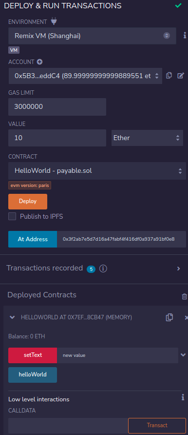
3. Once setText() is run, we can see the added balance in the contract:
    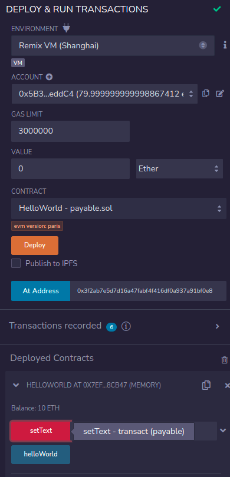
4. Transaction details:
    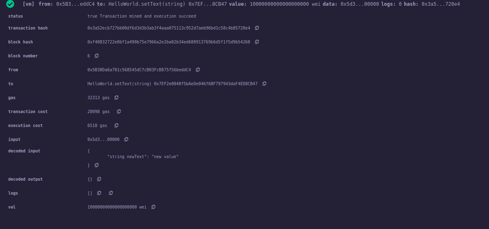
## Using Metamask wallet in Remix
1. In Environment Dropdown, choose `WalletConnect`>`Connect to a Wallet`>`Metamask`, or choose `InjectedProvider>MetaMask`
2. Now when we, deploy a contract, we get a Metamask prompt:  
    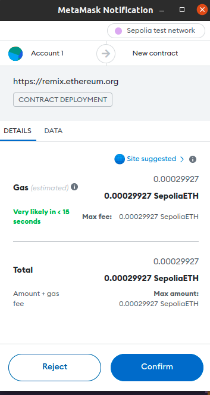
3. In the terminal, we get a link to the Etherscan log  
    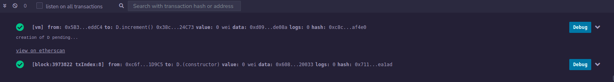  
    * eg. the smart contract (from class 2):
        ```
        // SPDX-License-Identifier: MIT
        pragma solidity >=0.7.0 <0.9.0;
        
        contract HelloWorld {
            string private text;
        
            constructor() {
                text = "abcd";
            }
        
            function helloWorld() public view returns (string memory) {
                return text;
            }
        
            function setText(string memory newText) public {
                text = newText;
            }
        }
            
        ```
    * The details - https://sepolia.etherscan.io/tx/0x84615f89347ceeba759bf71cc40936fba39adc5a95680a972e02a3f70bc03412
    * State Transition:
        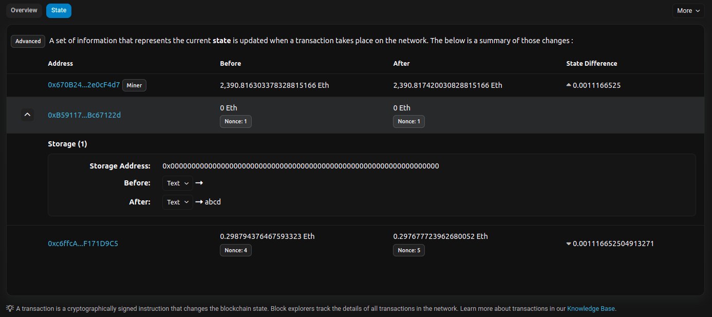
    * Although the var was private, we can see the change (reminder that private only prevents other contracts from reading info, but its still visible outside the blockchain)
    * Then I executed setText once more - https://sepolia.etherscan.io/tx/0x76dce249ee00e9a1b2069faa50e3bf41054f66aefa68af8a1dfd78e237be009e
    * State Transition 
        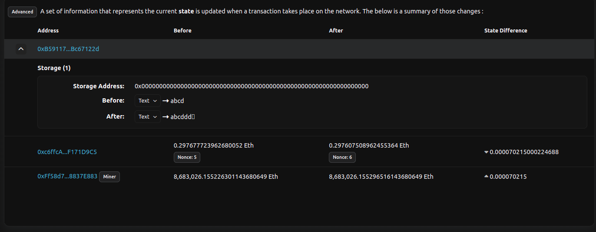
    
## Multiple contracts in same sol file
* Choose which contract to deploy from the Contract dropdown:
        ```
        // SPDX-License-Identifier: MIT
        pragma solidity >=0.7.0 <0.9.0;
        
        contract HelloWorld {
            string private text;
        
            constructor() {
                text = "abcd";
            }
        
            function helloWorld() public view returns (string memory) {
                return text;
            }
        
            function setText(string memory newText) public {
                text = newText;
            }
        }
        
        contract HelloWorld2 {
            string private text2;
        
            constructor() {
                text2 = "abcd";
            }
        
            function helloWorld2() public view returns (string memory) {
                return text2;
            }
        
            function setText2(string memory newText) public {
                text2 = newText;
            }
        }
        ```
## Abstract Contracts
Contracts must be marked as abstract when at least one of their functions is not implemented or when they do not provide arguments for all of their base contract constructors. Even if this is not the case, a contract may still be marked abstract, such as when you do not intend for the contract to be created directly.  
* Abstract Contracts can't be instantiated directly:
    ```
        // SPDX-License-Identifier: GPL-3.0
        pragma solidity >=0.6.0 <0.9.0;
        
        abstract contract Feline {
            function utterance() public virtual returns (bytes32);
        }

    ```
    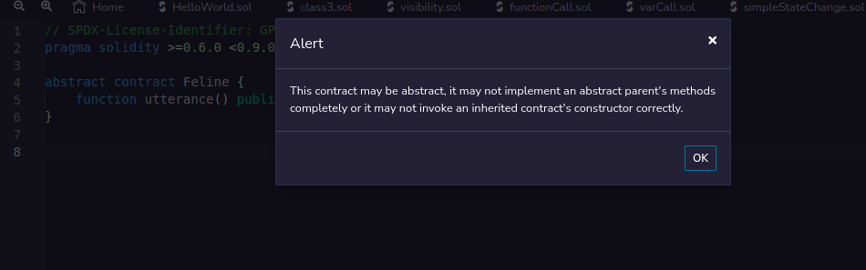
* They can be used as a base class:
    ```
    // SPDX-License-Identifier: GPL-3.0
    pragma solidity >=0.6.0 <0.9.0;
    
    abstract contract Feline {
        function utterance() public virtual returns (bytes32);
    }
    
    contract Cat is Feline {
        function utterance() public pure override returns (bytes32) {
            return "miaow";
        }
    }
    
    ```
* If a contract inherits from an abstract contract and does not implement all non-implemented functions by overriding, it needs to be marked as abstract as well.  
    ```
    // SPDX-License-Identifier: GPL-3.0
    pragma solidity >=0.6.0 <0.9.0;
    
    abstract contract Feline {
        function utterance() public virtual returns (bytes32);
        function utterance2() public virtual returns (bytes32);
    }
    
    abstract contract Cat is Feline {
        function utterance() public pure override returns (bytes32) {
            return "miaow";
        }
    }
            
    ```
## Interfaces
Interfaces are similar to abstract contracts, but they cannot have any functions implemented. Other restrictions: They cannot inherit from other contracts, but they can inherit from other interfaces.

* All declared functions must be external in the interface, even if they are public in the contract.

* They cannot declare a constructor.

* They cannot declare state variables.

* They cannot declare modifiers.

Interfaces also can't be deployed alone

Purpose :
1. Compliance - To force functions to adhere to the definitions set within an interface
    ```
    pragma solidity >=0.6.2 <0.9.0;
    
    interface ParentA {
        function test() external returns (uint256);
    }
    
    interface SubInterface is ParentA {
        // Must redefine test in order to assert that the parent
        // meanings are compatible.
        function test() external override(ParentA, ParentB) returns (uint256);
    }
    ```
2. Solidity allows you to interact with other contracts without having their code by using their interface. For example, if you want to interact with another contract from your own contract, you provide your calls with an interface wrapper. To demostrate:
    * Create ChangeState.sol:
        ```
        // SPDX-License-Identifier: UNLICENSED
        pragma solidity ^0.8.7;
        
        contract ChangeState {
            string message;
        
            constructor() {
                message = "Hello World!";
            }
        
            function setMessage(string memory newMessage) public {
                message = newMessage;
            }
        
            function getMessage() public view returns (string memory) {
                return message;
            }
        }        
                
        ```

        ABI of compiled ChangeState.sol:
        ```
            [
            	{
            		"inputs": [],
            		"stateMutability": "nonpayable",
            		"type": "constructor"
            	},
            	{
            		"inputs": [],
            		"name": "getMessage",
            		"outputs": [
            			{
            				"internalType": "string",
            				"name": "",
            				"type": "string"
            			}
            		],
            		"stateMutability": "view",
            		"type": "function"
            	},
            	{
            		"inputs": [
            			{
            				"internalType": "string",
            				"name": "newMessage",
            				"type": "string"
            			}
            		],
            		"name": "setMessage",
            		"outputs": [],
            		"stateMutability": "nonpayable",
            		"type": "function"
            	}
            ]
        ```
    * Deploy it and note the contract address, then remove the contract deployment.
    * In a new file, Interact.sol, define an interface to interact with it
        ```
        // SPDX-License-Identifier: GPL-3.0
        pragma solidity ^0.8.7;
        
         interface ChangeState {
             function setMessage(string memory newMessage) external;
        
             function getMessage() external view returns (string memory);
         }
        
        
        ```
        ABI of compiled Interact.sol:
        ```
        [
        	{
        		"inputs": [],
        		"name": "getMessage",
        		"outputs": [
        			{
        				"internalType": "string",
        				"name": "",
        				"type": "string"
        			}
        		],
        		"stateMutability": "view",
        		"type": "function"
        	},
        	{
        		"inputs": [
        			{
        				"internalType": "string",
        				"name": "newMessage",
        				"type": "string"
        			}
        		],
        		"name": "setMessage",
        		"outputs": [],
        		"stateMutability": "nonpayable",
        		"type": "function"
        	}
        ]
        ```
    * Compile Interact.sol and put the address of deployed CHangeState.sol in the `At Address`
    * Now in Deployed Contracts, we're able to interact with ChangeState contract using just the interface  
## Interacting with a contract from its address in Remix
1. Deploy the contract: 
    ```
         // SPDX-License-Identifier: GPL-3.0
        pragma solidity >=0.6.2 <0.9.0;
        
        contract HelloWorld {
            string private text;
        
            constructor() {
                text = "abcd";
            }
        
            function helloWorld() public view returns (string memory) {
                return text;
            }
        
            function setText(string memory newText) public {
                text = newText;
            }
        }
    
    ```
2. Remove the contract deployment, but the sol file with the entire contract must be compiled 
3. Note : If using an interface, we can remove all the code, except the interface and still be able to interact with the contract. (This is the second use of interfaces listed above)

4. In `At Address`, give the address of the deployed contract (To from the txn) to load the contract
5. Now we can interact with the contract again

## NATSPEC Format
Solidity contracts can use a special form of comments to provide rich documentation for functions, return variables and more. This special form is named the Ethereum Natural Language Specification Format (NatSpec).
* /// for comments
* @notice tag - for end users
* @dev tag - for devs, with more technical detail
* rest are self explanatory  
e.g:
```
// SPDX-License-Identifier: GPL-3.0
pragma solidity >=0.8.2 < 0.9.0;

/// @title A simulator for trees
/// @author Larry A. Gardner
/// @notice You can use this contract for only the most basic simulation
/// @dev All function calls are currently implemented without side effects
/// @custom:experimental This is an experimental contract.
contract Tree {
    /// @notice Calculate tree age in years, rounded up, for live trees
    /// @dev The Alexandr N. Tetearing algorithm could increase precision
    /// @param rings The number of rings from dendrochronological sample
    /// @return Age in years, rounded up for partial years
    function age(uint256 rings) external virtual pure returns (uint256) {
        return rings + 1;
    }

    /// @notice Returns the amount of leaves the tree has.
    /// @dev Returns only a fixed number.
    function leaves() external virtual pure returns(uint256) {
        return 2;
    }
}

contract Plant {
    function leaves() external virtual pure returns(uint256) {
        return 3;
    }
}

contract KumquatTree is Tree, Plant {
    function age(uint256 rings) external override pure returns (uint256) {
        return rings + 2;
    }

    /// Return the amount of leaves that this specific kind of tree has
    /// @inheritdoc Tree
    function leaves() external override(Tree, Plant) pure returns(uint256) {
        return 3;
    }
}
```
## References
1. https://blog.paulmcaviney.ca/solidity-interfaces
2. https://medium.com/coinmonks/solidity-tutorial-all-about-interfaces-f547d2869499