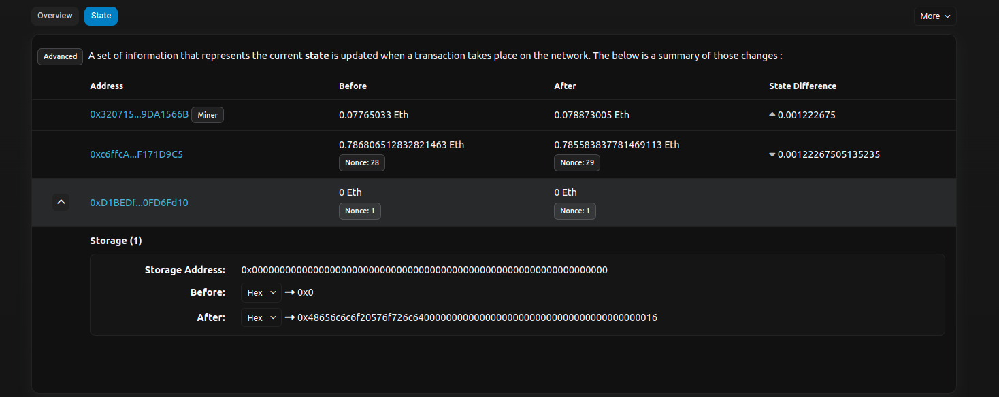
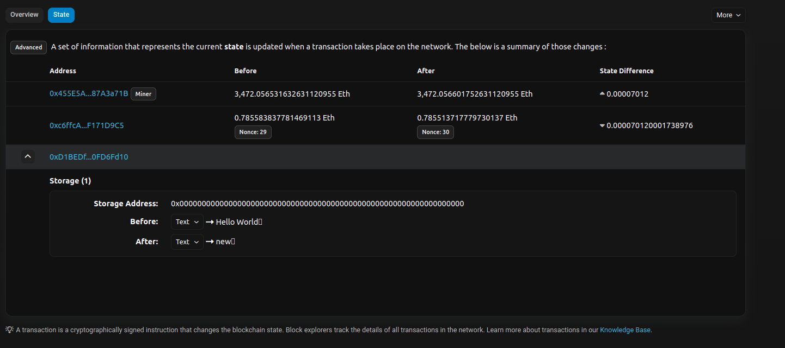
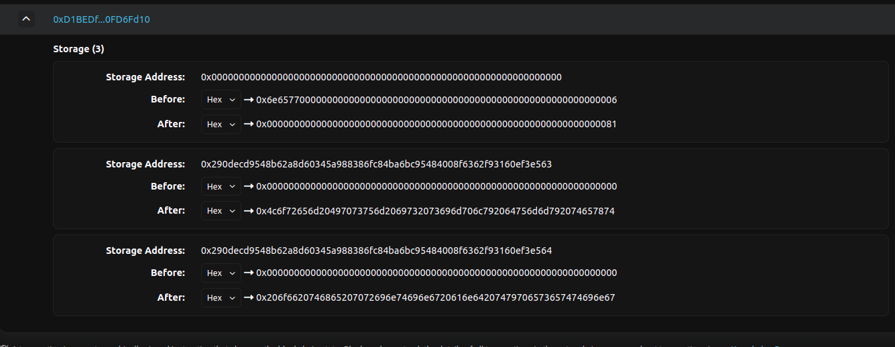
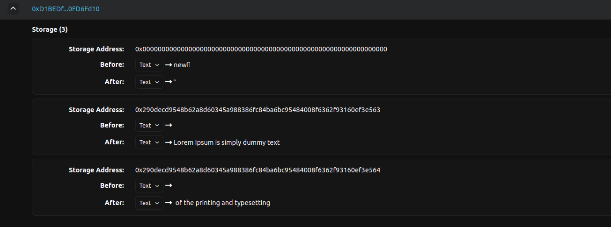
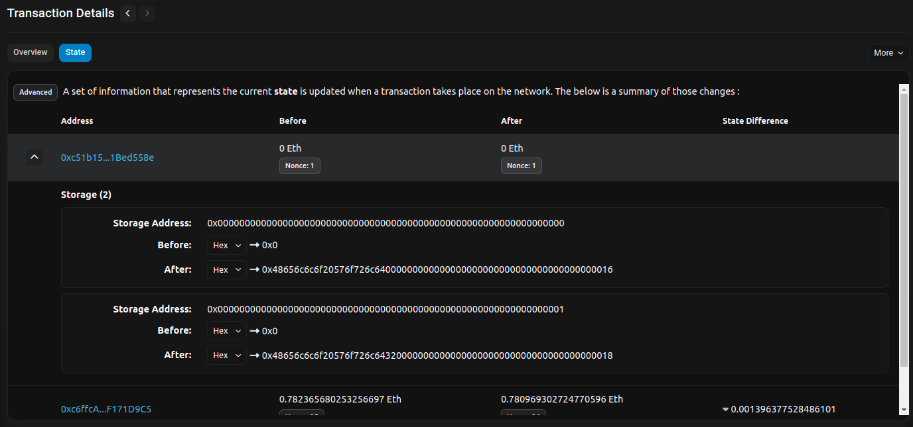
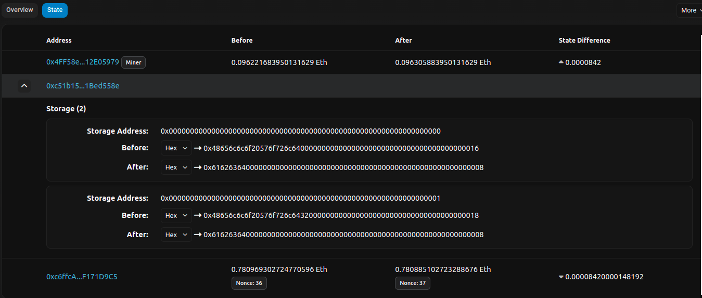
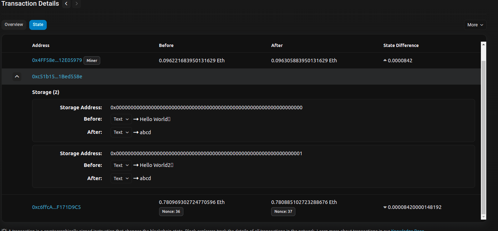

# Class 3 - Storage, Assertions, Modifiers
## **The Base Contract**
```
// SPDX-License-Identifier: MIT
pragma solidity >=0.7.0 <0.9.0;

contract HelloWorld { 
    string public text; //stored in storage

    constructor() {
        text = "Hello World";
    }

    /// @notice Returns value of text
    function helloWorld() public view returns (string memory) {
        return text;
    }

    /// @param newText Text to be saved in state var
    /// @dev param value can be optimized to use less gas   
    function setText(string memory newText) public payable{
        text = newText;
    }
}
```
## **Storage, Memory and the Stack** 
1. **Storage** : Every account (wallet accounts and smart contract accounts) has a persistent key-value store mapping 256-bit words to 256-bit words called storage.
    * Comparatively costly to read, and even more to initialise and modify storage
    * We should minimize what you store in persistent storage to what the contract needs to run. Store data like derived calculations, caching, and aggregates outside of the contract
    * Every state variable has a separate storage address
    * State variables are stored in Storage :

    * Analyzing storage when a contract is deployed (the After hex is Hello world)(https://sepolia.etherscan.io/tx/0x3e67b84ed9ae200a755f62f5150a039910c4509b4b3713b800cafc5f85ba3489)
        
    * Storage when we call setText and change value: (https://sepolia.etherscan.io/tx/0xbe56755b2872b442c0c18b3605d23169654efd73da4aacaba61d6dad435f4d40)
        
    * When we set a larger value for text, its broken down into multiple smaller addresses,
        * Maximum space in one storage address in 256 bits ie 32 bytes ie 32 characters usually 
        *  but they're not sequential (linked by one byte at the end): (https://sepolia.etherscan.io/tx/0x961ef26bb3449d085fa89bb314db9820400ad4de6d2a380bf7a7a1f8908e4808)
        
        
    
    ### Contract with Multiple state variables
    ```
    // SPDX-License-Identifier: MIT
    pragma solidity >=0.7.0 <0.9.0;
    
    contract HelloWorld { 
        string public text;
    
        string public text2;
        constructor() {
            text = "Hello World";
            text2 = "Hello World2";
        }
    
        /// @notice Returns value of text
        function helloWorld() public view returns (string memory) {
            return text;
        }
    
        /// @param newText Text to be saved in state var
        /// @dev param value can be optimized to use less gas   
        function setText(string memory newText) public payable{
            text = newText;
            text2 = newText;
        }
    }
    ```
    * Deployment : https://sepolia.etherscan.io/tx/0x69346cfb5a8d8743c934dcdf52fddb6f0c6a808854eaa39fdb92bcbb32e54874
    Here, we can see multiple addresses for multiple variables
        
    * SetText("abcd"): https://sepolia.etherscan.io/tx/0xf0636c664dd47540c1918246681523a973cc490c1fac8d4d811fb433f9d2c1fb
        
        
    * When trying to set  a long string (abcdabcdabcdabcdabcdabcdabcdabcdabcdabcdabcdabcdabcdabcdabcdabcdabcdabcdabcdabcdabcdabcdabcdabcd) : https://sepolia.etherscan.io/tx/0xc796676705308bfb5c0218ab09497349c5ca3c075207c46c9246923d3847d5f8#statechange
2. Memory : A Smart contract obtains a freshly cleared memory for each message call - its ephemeral, fresh memory for every call
    * Memory is linear and can be addressed at byte level, but reads are limited to a width of 256 bits, while writes can be either 8 bits or 256 bits wide.
    * 
    ```
    /// for value types, the type can be only be in memory, hence it doesn't have to be specified
    function newValue() public view returns(uint256) {
       uint256 valueReturn = value1;
       valueReturn = 10;
       return valueReturn;
    }

    /// for reference types like string, the type can be in memory, in storage or in calldata, so it has to be specified
    /// valueReturn is  a pointer - returns reference to location in memory

    function newValue() public view returns(string memory) { //memory has to be specified for string
       string memory valueReturn = value4; //memory has to be specified for string
       valueReturn = 'Hello World';
       return valueReturn;
    }

    /// newText resides in memory
    function setText(string memory newText) public payable{
       
        string memory valueReturn = value4; // variable stored in memory

        text = newText;
    }
    ```
3. Calldata : It is where arguments passed to functions are temporarily stored. 
    * It is not a place where we can create variables, because it is unique to function arguments. 
    * It is also not possible to change the values of calldata: it is read-only.
    * Using calldata instead of memory saves a bit of gas 
        ```
        function setText(string calldata newText) public payable{
            text = newText;
        }
        ``` 
    * We can also return from calldata - provided the variable is already in calldata ie was received as a calldata parameter
        ```
        function getText(string calldata newText) public view returns(string calldata) { //memory has to be specified for string
           return newText;
        }
        ```
    * Takeaway : Whenever we need to pass static data to a function as an argument- use calldata
    #TODO - compare gas of calldata,memory arguments 
4. Stack  : The EVM  stack machine, so all computations are performed on a data area called the stack. 
   * It has a maximum size of 1024 elements and contains words of 256 bits. 
   * Access to the stack is limited to the top end in the following way: 
   * It is possible to copy one of the topmost 16 elements to the top of the stack or swap the topmost element with one of the 16 elements below it. 
   * All other operations take the topmost two (or one, or more, depending on the operation) elements from the stack and push the result onto the stack. 
   * Of course it is possible to move stack elements to storage or memory in order to get deeper access to the stack, but it is not possible to just access arbitrary elements deeper in the stack without first removing the top of the stack.
    #todo - research how stack is used

## Comparing strings
* Since strings are arrays and so are bytes, they can't be compared directly (if we have to it has to be done element by element), hence we compare hashes
* `check_ = keccak256(bytes(text)) == keccak256(bytes(text2));`
## Encapsulation, Assertions, Naming Conventions, Named Return`
* _variable/_function() : convention for private/internal variables or functions
* variable_ : convention to avoid naming collisions
* Encapsulation  : Public function calling private function
    ```
    // SPDX-License-Identifier: GPL-3.0
    pragma solidity >=0.7.0 <0.9.0;
    
    contract HelloWorld {
        string private text;
    
        constructor() {
            text = pureText();
        }
    
        function helloWorld() public view returns (string memory) {
            return text;
        }
    
        function setText(string calldata newText) public {
            text = newText;
        }
    
        function pureText() public pure returns (string memory) {
            return "Hello World";
        }
    
        /// How strings are compared, they can't be compared directly since they're arrays
        /// Checks if text and pureText() ie Hello World match
        function _isPure() internal view returns (bool check_) {
            check_ = keccak256(bytes(text)) == keccak256(bytes(pureText()));
        }
        
        /// Encapsulation + Named Return : We give a name to return var in func definition, and don't have to explicity add return
        function isPure() public view returns (bool returnValue_) {
            returnValue_ = _isPure(); //returns the value from is _isPure(), because returnValue_ is already specified for return
        }
    
        function _restore() internal {
            text = pureText();
        }
         
        modifier onlyWhenNotPureText(){
            /// Assertion
    
            require(!_isPure(),"The contract already has the initial text"); // 2nd argument : error if condition not met
            -; // function is executed here
        }
    
        /// modifier onlyWhenNotPureText attached to func
        function restore() public onlyWhenNotPureText returns (bool) {
            _restore();
            return true;
        }
    }
    ```
## Modifier 
 modifier is a special function that is used to modify the behavior of other functions. It has some conditions and `_;` - the merge wildcard symbol. The body of the function (to which the modifier is attached to) will be inserted where the special symbol _; appears in the modifier’s definition. e.g:
```
/// Function that's only accessible to authorized users
function ReadSensitiveData() public view IsAuthorised returns(bool) {
    //Code ......
    return true;
}
function CheckIfAuthorized(address _user) public view returns(bool) {
    // logic that checks that _user is authorised
    return true; 
}
modifier IsAuthorised {
    require(CheckIfAuthorized(msg.sender));
    _; // Rest of function call resumes from here
}
```

## Assertion - Halt execution of a function
1. assert :  creates an error of type Panic(uint256)    
    * Should only be used to test for internal errors, and to check invariants. 
    * Properly functioning code should never create a 
2. require :  either creates an error without any data or an error of type Error(string).
    * It should be used to ensure valid conditions that cannot be detected until execution time. This includes conditions on inputs or return values from calls to external contracts.
    * Calling require(x) where x evaluates to false - Error
* Example  :
    ```
    // SPDX-License-Identifier: GPL-3.0
    pragma solidity >=0.5.0 <0.9.0;
    
    contract Sharer {
        function sendHalf(address payable addr) public payable returns (uint balance) {
            require(msg.value % 2 == 0, "Even value required.");
            uint balanceBeforeTransfer = address(this).balance;
            addr.transfer(msg.value / 2);
            // Since transfer throws an exception on failure and
            // cannot call back here, there should be no way for us to
            // still have half of the Ether.
            assert(address(this).balance == balanceBeforeTransfer - msg.value / 2);
            return address(this).balance;
        }
    }
    ```
3. revert : A direct revert can be triggered using the revert statement and the revert function.
    * A direct revert can be triggered using the revert statement and the revert function.
    * Using revert() causes a revert without any error data while revert("description") will create an Error(string) error.
  
#TODO: Add more examples of assertions

## Block and Transaction Properties
These are global variables storing info about the block e.g:
* `block.number` : Current block number
* `block.timestamp`
* `msg.data` : Complete calldata
* `msg.sender` : Sender of current message
* `msg.value` : Amount of wei sent in a  payable function

#Todo - cover types, bytes, string as array https://docs.soliditylang.org/en/latest/types.html#
# References :
1. https://betterprogramming.pub/all-about-solidity-data-locations-part-i-storage-e50604bfc1ad
2. https://betterprogramming.pub/solidity-tutorial-all-about-calldata-aebbe998a5fc
3. https://medium.com/coinmonks/learn-solidity-lesson-13-storage-memory-calldata-and-the-stack-56342b6e5ed0
4. https://coinsbench.com/solidity-layout-and-access-of-storage-variables-simply-explained-1ce964d7c738
5. https://stackoverflow.com/questions/33839154/in-ethereum-solidity-what-is-the-purpose-of-the-memory-keyword
6. https://medium.com/blockchannel/the-use-of-revert-assert-and-require-in-solidity-and-the-new-revert-opcode-in-the-evm-1a3a7990e06e
7. https://dev.to/tawseef/require-vs-assert-in-solidity-5e9d
8. https://metana.io/blog/require-assert-revert-solidity/